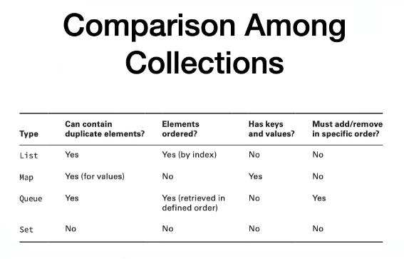

# BU CS 622 Assignment 3

## Requirements
- This project is built on top of my previous assignment, but has included a memory that keeps the track of what has been searched, in which it stores inputs which we give to the search.
- Search criteria and timestamp will be stored in a collection, and a method to call and print the number of search terms, their timestamps, and frequency.

## Collection Variables
In the main file, I have created these collections as shown below: 
```java
public static LinkedHashMap<String, String> searchHistory = new LinkedHashMap<>(); 
public static HashMap<String, Integer> searchFrequency = new HashMap<>();   
public static HashSet<String> searchedItems = new HashSet<>();
public static ArrayList<String> files = new ArrayList<>();
```
- `searchHistory`: I used the LinkedHashMap to store key value pairs and maintain the insertion orders - timestamps as the key, search items as the value; each search will add to the map with when it has been searched and the keyword of this search
- `searchFrequency`: I used the HashMap to track the frequency of searched keywords in which key as the search item, and integer value as the frequency; when search occur, we track if the key exist, if yes, then value plus 1, if not, then create a new key with value 1
- `searchedItems`: I used the HashSet collection to store all searched items, since set does not allow duplicate, fast, unordered and un-indexed which are not needed, we just track which items have been searched here
- `files`: I used ArrayList to collect all the path to current available json file, as we can access to the position of the element using index, so we can iterate through in SearchKeyword file, and check where this keyword exists for each file and get the json data returned

## Implementation Comparison in Map
- `HashMap`: does not maintain insertion order, O(1)
- `LinkedHashMap`: maintain insertion order, O(1)
- `TreeMap`: sorted ascending order based on keys, not elements, O(log N)

> Key in all Map is unique. \
> Add duplicate key, then it will be overwritten.

## Iterator
I also used iterator for the ArrayList in the `SearchKeyword`file.

- iterator used for arraylist, iterate over the list while the iterator has next item
```java
Iterator<String> iterator = args.iterator();
while (iterator.hasNext()) {
    String file = iterator.next();
    JSONParser parser = new JSONParser();
    JSONArray jsonArray = (JSONArray) parser.parse(new FileReader(file)); 

    if(customKeyword != null) {
        SearchAndPrintByCustomKeyword(customKeyword, key1, key2, jsonArray);
    }
}
```



## Files

I chose to use JSON file for this assignment, and used an external library called `org.json`

[The Library Downloaded here](https://mvnrepository.com/artifact/org.json/json)\
[Documentation: JSON package in Java](https://github.com/stleary/JSON-java)\
[Importing JSON library into IntelliJ IDEA](https://stackoverflow.com/questions/34676940/importing-json-library-into-intellij-idea)

### Local Setup

#### Way 1
Download the ZIP file and extract it to get the Jar. Add the Jar to your build path. 

To Add this Jar to your build path,
- Right-click the Project > Build Path > Configure build path> Select Libraries tab > Click Add External Libraries > Select the Jar file Download

#### Way 2
Use maven `mvn` to install local dependency
```
brew install maven
arch -arm64 brew install maven  => M1 chip

mvn -version
mvn package
```
Add Framework Support -> Maven -> pom.xml
```xml
<dependencies>
    <dependency>
        <groupId>org.json</groupId>
        <artifactId>json</artifactId>
        <version>20220320</version>
    </dependency>
    <dependency>
        <groupId>com.googlecode.json-simple</groupId>
        <artifactId>json-simple</artifactId>
        <version>1.1</version>
    </dependency>
</dependencies>
```

#### Finally
Don't forget to import the class to your IDE, and build it with the library.

[Importing JSON library into IntelliJ IDEA](https://stackoverflow.com/questions/34676940/importing-json-library-into-intellij-idea)

## Merge Content
In this question, I implemented exception handling through a try/catch + finally block to catch runtime errors during runtime for IO, 
where in the try block I write code, catch block to catch exception as specific as possible, finally block will always run at the end.

Since write a code to merge the content of all days into a single file, I looped through to get the open_date and close_date for each dataset of each file,
and then write the json object to a new file called `days.json`.

## Search Keyword
In this question, I implemented regular expression which matches a pattern or a character, 
and on top of the regular expression, also I have implemented exception handling for IO through a try/catch + finally block.

Since the question needs to search for a given keyword, I provided some kind of variations through the concept of overloading. 
You can search multiple files, or a single file by provided default keyword, or you can put in the keyword and/or the specific file you would like to search as argument.

## JSON Data
[Data Resource](https://webrobots.io/indiegogo-dataset)

Since each JSON file downloaded directly from the website is huge, I have used the file partially and keep it in separate file.