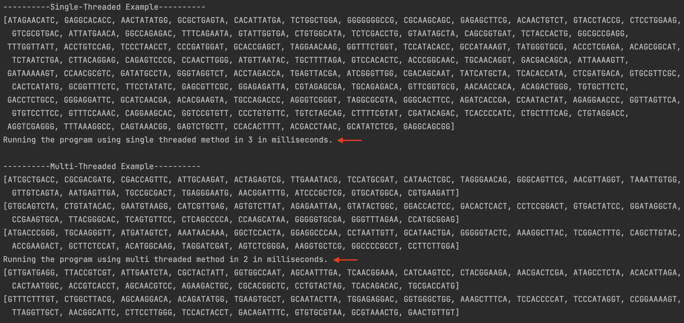
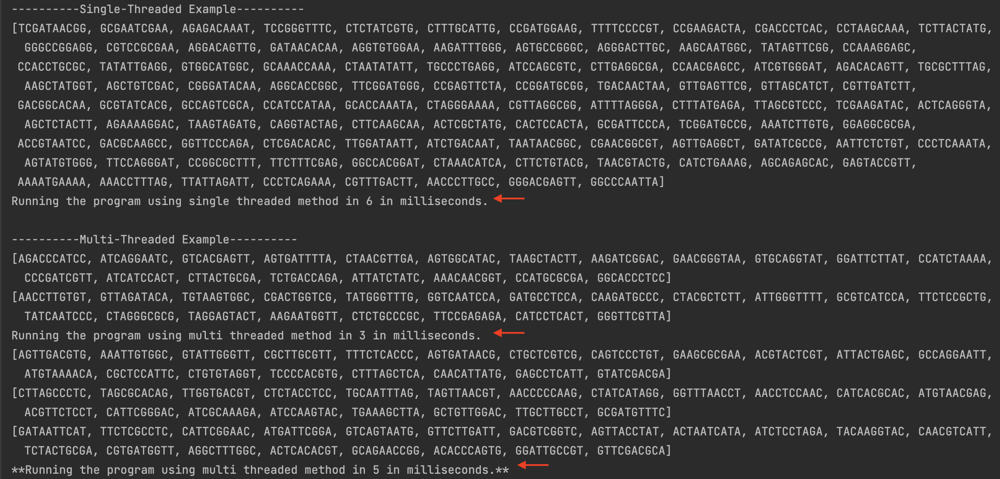

# BU CS 622 Assignment 4

## Requirement
> - Genome sequence is a character string that include A,T,G,C.
> - Create a program that creates 100 random genome sequence each should be 10 character
long.
> - e.g. ATGGCAACAG, CAACATCAGC, TTCTCTGTTT.

I have initialized a final `genomeCharacter` array to store the 4 character which will be used to random genome sequence.
`final private static String[] genomeCharacter = {"A", "T", "G", "C"};`

Then, I used Random method to randomly get an integer between 0 and 3, and access to the index of the `genomeCharacter` array.
```java
Random random = new Random();
int index = random.nextInt(4);
System.out.println(genomeCharacter[index]);
```

I have also initialized a final `eachGenomeLength` variable to store the length of each genome.
`private final static int eachGenomeLength = 10;`

A `sequence` method that create a customized number of random genome sequence with pass-in parameter as the length of total sequence we would like to create. 
```java
public static void sequence(int totalLength){
    ArrayList<String> randomGenomeSequence = new ArrayList<>();
    Random random = new Random();   //use random to generate a random integer
    int counter = 0;

    while (counter < totalLength) {
        String genome = "";     //reset to empty every time a new while loop starts
        while (genome.length() < eachGenomeLength) {
            int index = random.nextInt(4);    //generate a random number 0 and 3 => which will be used as the index of our genome array
            genome = genome.concat(genomeCharacter[index]);     //concat to the string until 10 characters long
        }
        randomGenomeSequence.add(genome);   //add to the ArrayList of each genome with 10 character long
        counter++;
    }

    System.out.println(randomGenomeSequence);
}
```

## Concurrency
> - After creating this program now use concurrency to make this program faster. 
> - For example, we can use five threads to create 20 genome sequence each.

#### Single Thread vs Multi Thread
- Single-Threaded: from beginning to end without interruption.
- Multi-Threaded: execute multiple threads concurrently.

#### Thread vs Runnable
- Thread is a class
- Runnable is an interface
- The Thread class implements Runnable

#### Boilerplate Code
```java
public class ThreadExample implements Runnable { 
    @Override
    public void run(){
        // will execute what is running inside the thread (the content of a thread)
    }
}
```
```java
private static ThreadExample example = new ThreadExample();
private static Thread thread = new Thread(example);
thread.start(); //start(), run the thread, will start a new thread and the JVM assigns it to a CPU core.
```

## Report
> Report the differences between single thread and multithread run. Having no significant differences is not a problem.



The picture above shows that the message for the `single-threaded` would be printout when the program finishes running. And the message for the `multi-threaded` would be printout while the program is still running since the execution of the programs is running concurrently.



#### Waiting threads to finish completely

- Use `join()` which allows the calling thread to wait until another thread gets its task done
- We can also use `isAlive()` to refer a thread that has begun but not been terminated yet

Here we added a try catch block with the join method that makes sure all the threads are done, then we get the duration for the operation from start to finish.

### Finding
Our program is small, so the difference is not obvious. I have run several times, the result is pretty similar, just the multi-threaded concurrency seems to be a bit faster.